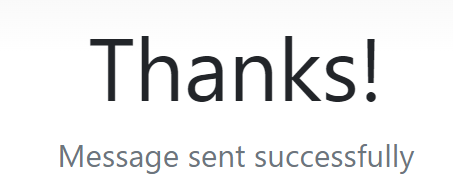
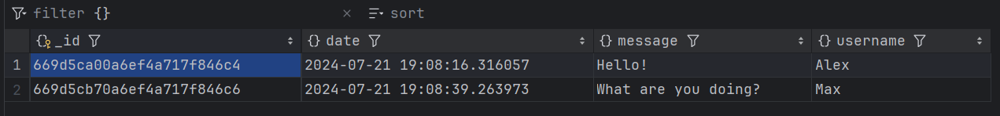

# goit-cs-hw-06

---

Деталі:
- Сокет-сервер використовує TCP протокол
- Веб-сервер приймає з'єднання на порті 3000
- Веб-сервер приймає повідомлення від клієнта
- Сокет-сервер записує дані в базу даних
- Веб-сервер відправляє результат обробки повідомлення назад клієнту
- База даних не втрачає дані після перезавантаження за рахунок volume

Запуск програми:
```
docker-compose up
```
Зупинка програми:
```
docker-compose down
```

----

Результат:



